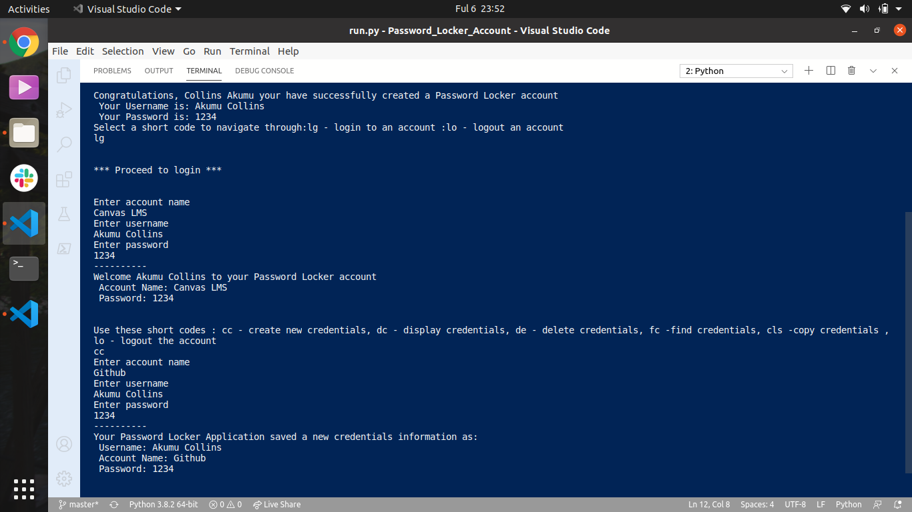

***

# PASSWORD LOCKER

#### **Monday September 6 2020** ;

***

## Author
> By **Akumu Collins** ;

***

### Here is the **WebPage Screenshoot** ;

---

## Description
> This application  allows users to  manage their passwords and even generate new unique random passwords for the users. Users can also create new account, display and view the saved accounts, find the existing accounts and delete an account.

## Setup/Installation Requirements
* install the latest python3 in your computer with $ sudo apt-get update and sudo apt-get install python3.6 command
* install pip in you computer using $sudo apt install python3-pip comand
* install virtual environment in your computer also using $ sudo pip3 install virtualenv and $ python3 -m venv myenv command
* get the project in github
* copy and  paste the clone link from the global sidebar in gitbut to your terminal
* use this instead, git clone https://github.com/Akumucollins/Password_Locker.git in your local terminal
* cd to the project directory issued after cloning it.
* code . /atom . command  to open the text editor
* to make this project executable in the terminal use  #!/usr/bin/env python3.8 and $ chmod +x run.py
* to run or open the application program use $ python3 run.py

---

## Dependencies
>* TDD
>* Pyperclip
>* Virtual Environment

***

# Technologies Used

> Python.

***

## BDD
| Behaviour            | Input          | Output        |
| :---                 |     :---:      |          ---: |
| Initial short codes appears  |  User keys in y/n  |   If 'y' displayed input fields to signup or If  'n'displayed  input fields to login   |
| Short codes display  |  User keys in 'lg' or 'lo'  |   Input fields for the names and password appear    |
| Input fields accept input| User adds names and password  | Password locker account is created     |
| Display of short code appears    |    User keys in cc     |  User enters account name, username and username   |
| Display of short code reappears    |    User keys in dc     |  The account displays account name, username and password if there were saved account credentials   |
| Display of short codes reappear   |    User keys in de  |   The search_account is deleted by   |
|  Display of short codes reappear |  User keys in fc    | The account displays all the existing credentials in the credentials list    |
| Display of short codes appear   |     User keys in lo |  User logs out from their credentials account   |
| Options of either enter or generate password dispalys  |     If user keys in 'ip' or 'gp' |  'ip'- entered password, 'gp' - an 8 character password is generated automatically |
| Final short codes appear   |     User keys in ex |  User logs out from their password locker account application   |

---

## Support and Contact Information
> The application is an open-source product if you  want to improve it or include an event of a bug  contact this
> akumucollins001@gmail.com .

***

## License
The project is [MIT](LICENSE) licensed 